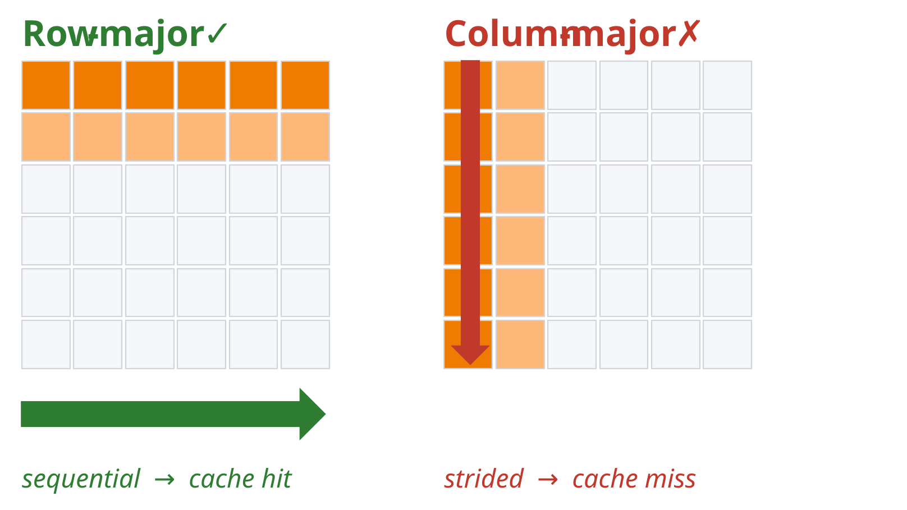
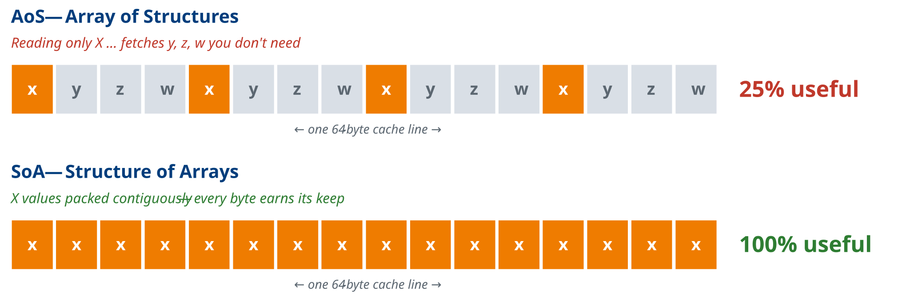
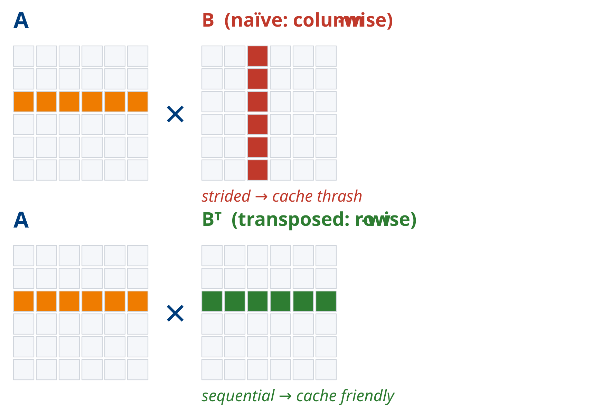
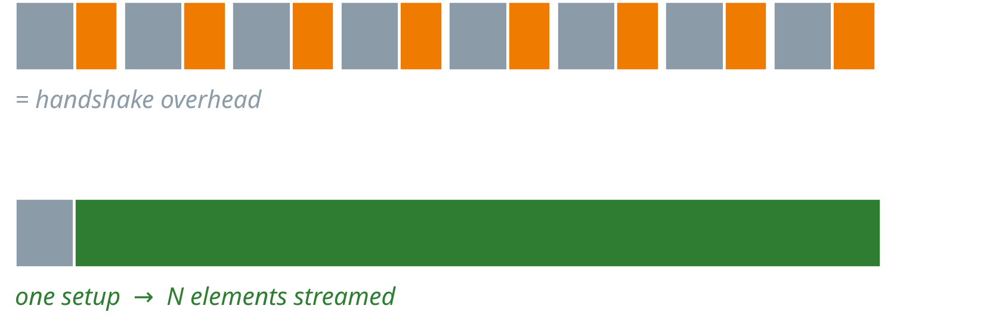

# Hardware Acceleration & Memory Access Examples

A reference for the code examples used to illustrate hardware acceleration concepts and memory access patterns. Each example is designed to build intuition for performance principles relevant to CPU, GPU, and FPGA platforms.

All examples are AI-generated. The repository is [here](https://github.com/NUS-CEG5203/nus-ceg5203.github.io/tree/main/docs/Accel_Examples).

---

## 1. `col_row_maj_cache.c`

**Summary:** Allocates a 2D matrix and traverses it in both row-major and column-major order, timing each access pattern.

**Significance:** Demonstrates the fundamental impact of spatial locality on CPU cache performance. Row-major traversal accesses memory sequentially (matching how C stores 2D arrays), resulting in high cache line utilisation. Column-major traversal strides across rows, causing frequent cache misses (only one useful word per fetch) and significantly higher latency. Directly analogous to DDR burst behaviour on FPGAs, where sequential AXI bursts are far more efficient than strided accesses.



**How to Run:**
```bash
gcc -O2 -o col_row_maj_cache col_row_maj_cache.c
./col_row_maj_cache
```
*Dependencies: standard C library (`time.h`). No external libraries required.*

---

## 2. `aos_vs_soa.c`

**Summary:** Compares two memory layout strategies — Array of Structures (AoS) and Structure of Arrays (SoA) — when summing a single field (x) across 64 million elements.

**Significance:** When only one field of a multi-field struct is accessed, AoS wastes 75% of each cache line fetching unused fields (y, z, w). SoA packs the needed field contiguously, maximising cache line utilisation. This trade-off directly maps to BRAM layout decisions in HLS and FPGA data path design, where field-wise access patterns determine whether interleaved or separate memory banks are more efficient.



**How to Run:**
```bash
gcc -O2 -o aos_vs_soa aos_vs_soa.c
./aos_vs_soa
```
*Dependencies: standard C library. No external libraries required.*

---

## 3. `matrix_transpose_optimization.c`

**Summary:** Benchmarks naive matrix multiplication (column-wise access of B) against a version that pre-transposes B to enable sequential row access in the inner loop.

**Significance:** The naive implementation accesses matrix B with a stride of N elements per step, defeating the cache on every inner-loop iteration. Pre-transposing B converts both operands to sequential row access, substantially improving cache hit rate. Demonstrates that a small amount of extra work (one transpose) can yield a large net gain — a principle that maps to BRAM bank partitioning and tiling strategies in HLS.

Cost: one extra O(N²) pass to transpose B.
Saved: O(N³) of cache misses in the inner loop.
This may sound counter-intuitive.

For FPGA, adding a reshape / tiling stage that costs area but unlocks a tight, pipelined inner dataflow.



**How to Run:**
```bash
gcc -O2 -o matrix_transpose matrix_transpose_optimization.c
./matrix_transpose
```
*Dependencies: standard C library. No external libraries required.*

---

## 4. `gpu_demo.c`

**Summary:** Uses OpenCL to run matrix multiplication (1024×1024) and element-wise vector multiplication (10M elements) on a GPU, comparing each against a CPU baseline.

**Significance:** Illustrates the distinction between compute-bound and memory-bound workloads. Matrix multiplication (O(N³) arithmetic intensity) achieves large GPU speedups because the GPU's parallel compute units are kept busy. Element-wise vector multiplication (O(N) arithmetic intensity) offers far less speedup — memory bandwidth, not compute throughput, is the bottleneck regardless of parallelism. Establishes the concept of arithmetic intensity as the key predictor of GPU (and FPGA accelerator) benefit.

Arithmetic Intensity is the FLOPs per byte moved.

In compute-bound, each byte fetched is reused many times. Arithmetic intensity is high — the GPU's thousands of ALUs actually get fed.

In memory-bound, each element is used a limited number of times (usually once) — one multiply per load. PCIe transfer + AXI/ DRAM bandwidth dominate; ALUs sit idle.

**How to Run:**
```bash
gcc -O2 -o gpu_demo gpu_demo.c -lOpenCL
./gpu_demo
```
*Dependencies: OpenCL runtime and ICD loader (`libOpenCL`). Requires a GPU with an OpenCL 1.2+ driver. Install via `sudo apt install ocl-icd-opencl-dev` on Ubuntu.*

---

## 5. `coalesced_vs_noncoalesced.c`

**Summary:** Runs two OpenCL matrix multiplication kernels — one with coalesced global memory access and one with non-coalesced access — and reports kernel execution time for each.

**Significance:** In GPU (and FPGA HBM/DDR) memory systems, coalesced access merges multiple work-item memory requests into a single wide transaction. The non-coalesced kernel accesses A and B with transposed indices, forcing individual narrow transactions and dramatically reducing effective bandwidth. Falls back to OpenMP CPU execution if no GPU is detected. Reinforces AXI burst vs. random-access behaviour familiar from FPGA design.

Note: `matmul_opencl.c` is the same program (identical code apart from its header comment).

**How to Run:**
```bash
gcc -O2 -fopenmp -o coalesced_vs_noncoalesced coalesced_vs_noncoalesced.c -lOpenCL
./coalesced_vs_noncoalesced [matrix_size]   # default N=1024
```
*Dependencies: OpenCL runtime and ICD loader (`libOpenCL`) for linking; OpenMP (included in GCC). If no GPU is found at runtime, the OpenMP CPU path is used instead.*

---

## 6. `vadd_comparison.cpp`

**Summary:** Defines two HLS-annotated vector addition kernels — a simple single-element version and a burst-optimised version with local ping-pong buffers — and benchmarks both in software simulation.

**Significance:** The burst kernel stages data through local BRAM buffers in chunks of 64 elements, mimicking the read–compute–write pattern used in real HLS designs to achieve pipelined AXI burst transfers. The `#pragma HLS` directives (`m_axi`, `PIPELINE`, `ARRAY_PARTITION`) show where the HLS annotations go, but the file is meant for desktop runs only: the dummy file-scope pragmas at the top make Vitis HLS reject it. The synthesisable versions are `kernel.cpp` and `kernel_burst.cpp` (section 9). Bridges the gap between algorithmic understanding and synthesisable FPGA code.

Note: The burst optimized one will most likely run slower on CPU. Why?

The same pattern everywhere:
CPU  → cache-line prefetch
GPU  → coalesced warp loads
FPGA → AXI burst reads

All three answer the same question: "pay the setup cost once, then stream."



**How to Run:**
```bash
g++ -O2 -o vadd_comparison vadd_comparison.cpp
./vadd_comparison
```
*Dependencies: standard C++ library only.*

---

## 7. `sum_halves.cpp`

**Summary:** An HLS kernel that reads a 2048-element integer array from BRAM and writes 1024 outputs, each the average of a corresponding pair of elements from the two halves of the input array.

**Significance:** A minimal but illustrative HLS design exercise. The `#pragma HLS PIPELINE` directive on the loop body targets an initiation interval of 1. The commented-out `ARRAY_PARTITION` pragma and the alternative three-way average serves to explore how port conflicts on the BRAM interface limit pipeline throughput, and how array partitioning resolves them — a core HLS optimisation concept. Please watch Lecture 13B recording for a live demo and exploration.

**How to Run:**
```bash
source ~/Xilinx/2025.1/Vitis/settings64.sh   # adjust to your install; sets $XILINX_VITIS

# Synthesis for the KV260 part
v++ -c --mode hls --part xck26-sfvc784-2LV-c --hls.flow_target vivado \
    --hls.syn.file sum_halves.cpp --hls.syn.top sum_halves --hls.clock 10ns --work_dir sum_halves
# Report (check the achieved II): sum_halves/hls/syn/report/sum_halves_csynth.rpt
```
*Dependencies: Vitis HLS 2025.1 (`v++`). There is no `main()` or testbench, so the file can't be built as a standalone executable; `g++ -c sum_halves.cpp` only checks the syntax.*

---

## 8. Tiled OpenCL Matrix Multiplication — `matmul_*.c`

**Summary:** Three variants of a tiled OpenCL matrix multiplication (`matmul_tiled` kernel, which stages tiles of A and B in `__local` memory). Each runs the kernel on the GPU and then on an OpenCL CPU device, falling back to a host implementation if no OpenCL CPU device exists, and prints a GPU-vs-CPU summary.

| File | CPU fallback | Tile size |
|---|---|---|
| `matmul_opencl _CPU fallback.c` | Plain C (single-threaded) | From command line (default 16) |
| `matmul_openmp.c` | OpenMP (multi-threaded) | From command line (default 16) |
| `matmul_opencl_autoselTileSize.c` | OpenMP (multi-threaded) | Auto-tuned from {8, 16, 32, 64}, limited by the device's max work-group size |

**Significance:** Tiling is how GPUs (and FPGA designs, via BRAM buffers) reuse data. Each element loaded from global memory into a local tile is used `tile` times instead of once, which raises arithmetic intensity (see `gpu_demo.c`). Comparing the plain-C and OpenMP fallbacks shows how much of the GPU's advantage a multi-core CPU can recover. The auto-tuning version shows that the best tile size depends on the hardware: it trades local-memory capacity and work-group limits against data reuse, just as tile and partition sizes are chosen in HLS.

**How to Run:**
```bash
# Plain C fallback (filename contains a space)
gcc -O2 -o matmul_cpu_fallback "matmul_opencl _CPU fallback.c" -lOpenCL
./matmul_cpu_fallback [N] [tile]          # defaults: N=1024, tile=16

# OpenMP fallback
gcc -O2 -fopenmp -o matmul_openmp matmul_openmp.c -lOpenCL
./matmul_openmp [N] [tile]

# Auto-selected tile size
gcc -O2 -fopenmp -o matmul_autotile matmul_opencl_autoselTileSize.c -lOpenCL
./matmul_autotile [N]
```
*Dependencies: OpenCL runtime and ICD loader (`libOpenCL`); OpenMP (included in GCC). Tile size must be ≤ 64 (the size of the `__local` arrays) and `tile²` must not exceed the device's max work-group size.*

---

## 9. HLS Vector Addition Kernels — `kernel.cpp`, `kernel_burst.cpp`, `test_Kernel.cpp`

**Summary:** Two Vitis HLS versions of a vector addition kernel `vadd` and a C testbench.
- `kernel.cpp` — the simple version: a single pipelined loop (`II=1`) reading A and B and writing C directly through one shared `m_axi` bundle (`gmem`), with `s_axilite` control.
- `kernel_burst.cpp` — the burst-optimised version: separate `m_axi` bundles per array (`gmem0/1/2`) and a read → compute → write loop over 64-element chunks held in fully partitioned local buffers.
- `test_Kernel.cpp` — testbench that runs `vadd` on 256 elements, compares against a software reference and prints PASSED/FAILED.

**Significance:** These are the synthesisable counterparts of `vadd_comparison.cpp`. Synthesising both kernels and comparing the reports (latency, AXI burst inference, resource usage) shows directly how splitting the AXI bundles and staging data in local buffers lets the tool infer long bursts and use the ports in parallel.

**How to Run:**
```bash
source ~/Xilinx/2025.1/Vitis/settings64.sh   # adjust to your install; sets $XILINX_VITIS

# C simulation (burst kernel + testbench)
g++ -O2 -I$XILINX_VITIS/include -o tb_vadd_burst kernel_burst.cpp test_Kernel.cpp
./tb_vadd_burst

# Synthesis for the KV260 part: run both and compare the reports
v++ -c --mode hls --part xck26-sfvc784-2LV-c --hls.flow_target vivado \
    --hls.syn.file kernel_burst.cpp --hls.syn.top vadd --hls.clock 10ns --work_dir vadd_burst
v++ -c --mode hls --part xck26-sfvc784-2LV-c --hls.flow_target vivado \
    --hls.syn.file kernel.cpp --hls.syn.top vadd --hls.clock 10ns --work_dir vadd_simple
# Reports: vadd_burst/hls/syn/report/vadd_csynth.rpt, vadd_simple/hls/syn/report/vadd_csynth.rpt
```
*Dependencies: Vitis HLS 2025.1 (`v++`; the kernels include `ap_int.h` and `hls_stream.h` from `$XILINX_VITIS/include`). `test_Kernel.cpp` declares the `kernel_burst.cpp` signature (`volatile int*`); to test `kernel.cpp`, change the declaration to `extern "C" void vadd(const int*, const int*, int*, int)`.*

---

## 10. OpenCL Sobel Edge Detection — `sobel_*`

**Summary:** Three OpenCL implementations of a 3×3 Sobel filter on an 8-bit greyscale image, plus host programs that time them.

| File | Role |
|---|---|
| `sobel_naive.cl` | Each work-item reads its 9 neighbouring pixels directly from global memory |
| `sobel_tiled.cl` | Each work-group cooperatively loads a tile plus a 1-pixel halo into `__local` memory, then computes from it |
| `sobel_image.cl` | Uses `image2d_t` objects and a sampler, so the GPU's texture cache and hardware edge clamping handle the memory access |
| `sobel_host.c` | Host program comparing the naive and tiled kernels (loads the `.cl` files at runtime) |
| `sobel_all_host.c` | Host program comparing all three kernels on a 1024×1024 random image |
| `run_sobel_all_host.sh` | Builds and runs `sobel_all_host` |
| `sobel_image_host.c` | Code fragment (not a full program) showing the image-object setup used for `sobel_image.cl` |

**Significance:** A stencil like Sobel reads each input pixel 9 times. The naive kernel fetches every one of those reads from global memory. The tiled kernel fetches each pixel once per work-group and reuses it from on-chip memory. This is the same idea as the line buffers / window buffers used for image processing in HLS. The image version shows a third option: relying on dedicated cache hardware instead of managing on-chip memory explicitly.

**How to Run:**
```bash
# Naive vs tiled
gcc -O2 -o sobel_host sobel_host.c -lOpenCL -lm
./sobel_host [width] [height] [block]     # run from this directory so the .cl files are found

# All three kernels
bash run_sobel_all_host.sh
```
*Dependencies: OpenCL runtime and ICD loader (`libOpenCL`) with a GPU device; `sobel_image.cl` needs image support (OpenCL 1.2+). `sobel_all_host` uses a fixed 1024×1024 image with 16×16 work-groups, so the arguments in `run_sobel_all_host.sh` are ignored.*

---

## Quick Reference

| File | Platform | Key Concept |
|---|---|---|
| `col_row_maj_cache.c` | CPU | Cache line utilisation, spatial locality |
| `aos_vs_soa.c` | CPU | Memory layout, field access efficiency |
| `matrix_transpose_optimization.c` | CPU | Cache-friendly access via pre-transpose |
| `gpu_demo.c` | GPU (OpenCL) | Arithmetic intensity, compute- vs memory-bound |
| `coalesced_vs_noncoalesced.c` / `matmul_opencl.c` | GPU (OpenCL) | Memory coalescing, transaction width |
| `vadd_comparison.cpp` | CPU | AXI burst pattern, HLS pipeline pragmas |
| `sum_halves.cpp` | HLS | BRAM port conflicts, array partitioning |
| `matmul_opencl _CPU fallback.c`, `matmul_openmp.c`, `matmul_opencl_autoselTileSize.c` | GPU (OpenCL) / CPU | Tiling in local memory, tile-size tuning, OpenMP baseline |
| `kernel.cpp`, `kernel_burst.cpp`, `test_Kernel.cpp` | HLS | AXI bundles, burst inference, HLS testbench |
| `sobel_*.cl`, `sobel_*host.c` | GPU (OpenCL) | Stencil data reuse, local-memory tiling with halo, image objects |
